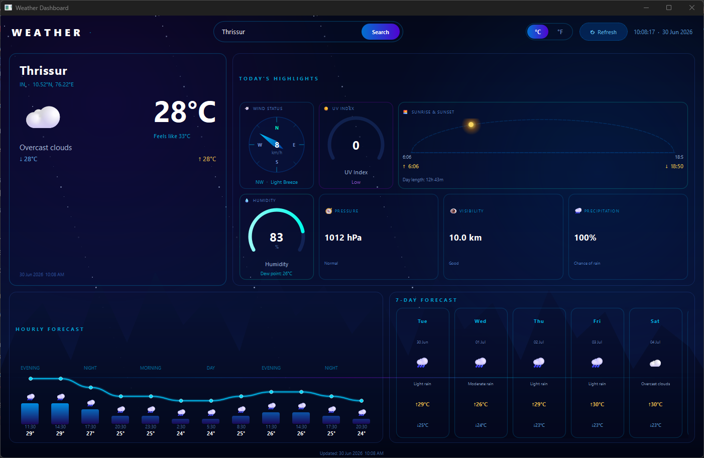
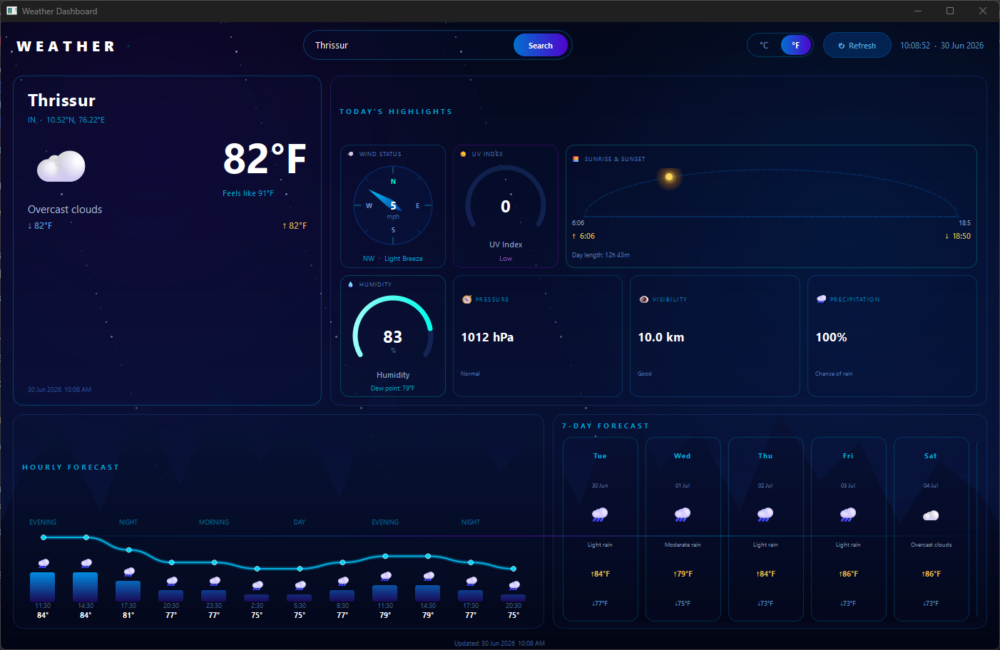

<div align="center">

# 🌦️ Weather Dashboard

### A cyberpunk-styled desktop weather app built with Python & PyQt6

[](https://www.python.org/)
[](https://pypi.org/project/PyQt6/)
[](https://openweathermap.org/api)
[](LICENSE)

---

> Live weather for any city · Hourly & 7-day forecasts · Metric ↔ Imperial in one click

</div>

---

## 📸 Screenshots

### Metric View


### Imperial View


---

## ✨ Features

**Current Conditions**
- Live temperature, "feels like," daily min/max, and condition description
- City name, country, and coordinates pulled straight from the API
- Animated deep-space background with a city skyline silhouette

**Today's Highlights**
- Wind compass with direction, speed, and Beaufort scale label
- UV index gauge with category (Low / Moderate / High / Very High / Extreme)
- Sunrise & sunset arc that tracks the sun's actual position in the city's local time
- Humidity gauge with dew point, plus pressure, visibility, and precipitation chance cards

**Forecasts**
- 12-slot hourly forecast with a temperature sparkline and per-hour weather icons
- 7-day forecast cards with daily high/low and condition icon
- Each forecast icon sits directly above its own bar, scaling with that hour's temperature

**Units & Search**
- One-click Metric (°C, km/h) ↔ Imperial (°F, mph) toggle — converts all live data instantly
- City search bar with Enter-to-search
- IP-based "locate me" fallback when no city is set
- Graceful demo-data mode when no API key is configured, so the app is never empty

**Window & UX**
- Live clock and "last updated" timestamp in the status bar
- Animated loading spinner during fetches
- Clear error messages for invalid cities, network issues, or missing API keys

---

## 📁 Project Structure

```
weather-dashboard/
│
├── gui.py    
├── core.py    
│
├── S1.png         ←  Metric view
├── S2.png         ←  Imperial view
├── T2_Demo.mp4    ← Full demo video
│
└── README.md
```

---

## ⚙️ Requirements

- **Python 3.8+**
- `PyQt6`
- `requests`

---

## 🚀 Installation & Running

**1. Clone the repository**
```bash
git clone <your-repo-url>
cd weather-dashboard
```

**2. Install dependencies**
```bash
pip install PyQt6 requests
```

**3. Set your OpenWeatherMap API key (optional but recommended)**
```bash
# macOS / Linux
export OWM_API_KEY="your_api_key_here"

# Windows 
$env:OWM_API_KEY="your_api_key_here"
```
> Get a free key at [openweathermap.org/api](https://openweathermap.org/api). Without a key, the app runs in **demo mode** with sample data for Thrissur.

**4. Launch the app**
```bash
python gui.py
```

---

## 🖥️ How to Use

1. Type a city name into the search bar and press **Enter** or click **Search**
2. Toggle **°C / °F** anytime — every card, chart, and gauge updates instantly
3. Click **↻ Refresh** to re-fetch the current city's weather
4. Check **Today's Highlights** for wind, UV, sunrise/sunset, humidity, pressure, visibility, and rain chance
5. Scroll the **7-Day Forecast** row to see the week ahead

---

## 🔌 Data Source

Weather data is fetched live from the [OpenWeatherMap](https://openweathermap.org/) Current Weather and 5-Day Forecast APIs. City search uses OpenWeatherMap's Geocoding API, and the optional "locate me" feature uses IP-based geolocation via [ip-api.com](https://ip-api.com/).

---

## 🎬 Demo

[](T2_Demo.mp4)

> Download or view `T2_Demo.mp4` from the repository for a full walkthrough.

---

## 👨‍💻 Author

**Basil Shaju**

---

